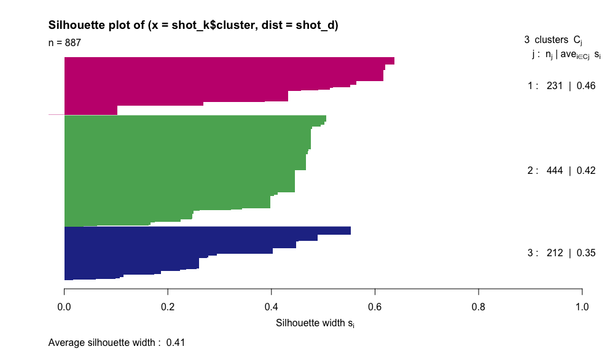

```{r setup, include=FALSE}
knitr::opts_chunk$set(echo = TRUE)
library(tidyverse)
library(plotly)
library(cluster)
library(knitr)
set.seed(2134)
load("shots.RData")
```

## I have finally got around to doing some work on NHL data. 

A couple of days ago, Sean Tierney ( [ChartingHockey on Twitter](https://twitter.com/ChartingHockey) ) posted this: 

```{r t1, echo=FALSE}
blogdown::shortcode('tweet', '1030799366913703937')
```

Sean does many great things with Tableau (see more [here](https://public.tableau.com/profile/sean.tierney)) so of course I was super excited to see these new charts. 

The data comes from [Moneypuck](http://moneypuck.com/about.htm) and shows shots for NHL seasons 2007-2017. The dataset can be downloaded from Moneypuck - there's over 1 million shots in the full dataset, however, so keep that in mind!

Looking at Sean's charts, I chose a few players off the top of my head and one thing I noticed was a distinct difference in shot types between defensemen and forwards.

```{r t2, echo=FALSE}
blogdown::shortcode('tweet', '1030808619988779008')
```

I have been meaning to do some analysis on hockey data for ages - but have never quite got properly around to it. But here I thought I might be able to do something relatively straightforward and see if I could cluster players based on their shot types. 

I had a (very) quick search but couldn't immediately see that anyone had done this with this dataset - but please do point me towards any similar analyses.

### Data wrangling:

I started by filtering the data to just include the 2015-2017 seasons - even so there are still about 340,000 shots - plenty to start with. 

```{r shot_type, echo = FALSE, eval = TRUE, include = FALSE}
shot_type <- shots%>%
  select(shooterName, shotID, shotType)%>%
  filter(shotType!="")
```
```{r view_shot_type, echo = F, eval = T}

knitr::kable(head(shot_type, 10))

```

I also picked a couple of variables as descriptors - team and position for each skater. 

```{r shooter_chars, echo = FALSE, eval = TRUE, include = FALSE}
shooter_chars<-shots%>%
  select(shooterName, teamCode, playerPositionThatDidEvent)%>%
  group_by(shooterName, playerPositionThatDidEvent)%>%
  unique()
```

```{r view_shooter_chars, echo = FALSE, eval = TRUE}

knitr::kable(head(shooter_chars, 10))

```

The first time I tried to cluster shot types, I used totals of each shot type per player. However, this ended up clustering into players who had lots of shots and players who had very few shots - which is not very interesting or useful. 

So I took the total of each shot type as a proportion of total shots taken by that player. (I thought about filtering out anyone who hadn't had a certain number of shots - but decided against it at this stage as it looked like it would exclude too many players (e.g. the median total is 148 shots)).

```{r shot_tot, echo = FALSE, eval = TRUE, include = FALSE}
shot_cat <- shot_type%>%
  mutate(defl = ifelse(shotType == "DEFL", 1, 0),
         back = ifelse(shotType == "BACK", 1, 0),
         wrist = ifelse(shotType == "WRIST", 1, 0),
         slap = ifelse(shotType == "SLAP", 1, 0),
         snap = ifelse(shotType == "SNAP", 1, 0),
         tip = ifelse(shotType == "TIP", 1, 0),
         wrap = ifelse(shotType == "WRAP", 1, 0))

row.names(shot_cat)<-shot_type$shotID

shot_tots<-shot_cat%>%
  group_by(shooterName)%>%
  summarize(defl = sum(defl == 1),
            back = sum(back == 1),
            wrist = sum(wrist == 1),
            slap = sum(slap == 1),
            snap = sum(snap = 1),
            tip = sum(tip = 1),
            wrap = sum(wrap = 1))

shot_tots$tot = rowSums(shot_tots[2:8], na.rm = TRUE)

shot_tots<-shot_tots%>%
  group_by(shooterName)%>%
  summarize(defl = round((defl/tot), 1),
            back = round((back/tot), 1),
            wrist = round((wrist/tot), 1),
            slap = round((slap/tot), 1),
            snap = round((snap/tot), 1),
            tip = round((tip/tot), 1),
            wrap = round((wrap/tot), 1),
            tot = tot)
```
```{r view_shot_tot, echo = FALSE, eval = TRUE}

knitr::kable(head(shot_tots, 10))

```

I wasn't sure how many clusters would be appropriate, so I ran k-means for 1:10 clusters and constructed an elbow plot - looking at this, the best number of clusters seemed to be 3 or 4. I chose 3 - when I tried it with 4, there were 2 clusters which seemed to have virtually no difference between them, although I'd like to explore this a bit further. 

``` {r kmeans1, echo = FALSE, eval = TRUE, include = FALSE}
nope <- c(1,9)
shot_dist <- (dist(shot_tots[, -nope], method = "euclidean"))
shot_dist <- (as.matrix(shot_dist))

tot_withinss <- map_dbl(1:10,  function(k){
  model <- kmeans(x = shot_dist, centers = k)
  model$tot.withinss
})

elbow_df <- data.frame(
  k = 1:10 ,
  tot_withinss = tot_withinss
)
```

```{r elbow, echo = FALSE, eval = TRUE}
plot(elbow_df$k, elbow_df$tot_withinss)
```

```{r kmeans2, echo = FALSE, eval = TRUE, include = FALSE}
shot_k <- kmeans(shot_dist, centers = 3)
shot_pam <- pam(shot_dist, k = 3)
```

``` {r sil, echo = FALSE, eval = TRUE}

plot(silhouette(shot_pam), border = NA, col = c("#c51b7d", "#5aae61", "#253494"))

```

```{r kmeans3, echo = FALSE, eval = TRUE, include = FALSE}
shot_cluster <- shot_k$cluster

shot_totsk <- mutate(shot_tots, cluster = shot_cluster)
```

## Cluster plots

You can see here the clusters mapped against wrist shots and slap shots (slap shots was where there seemed to be the biggest difference between players):

```{r ggplot shots, echo = FALSE, eval = TRUE}

ggplot(shot_totsk, aes(wrist, slap, color = factor(cluster)))+
  geom_jitter()+
  ggtitle("NHL shot type clusters")+
  labs(x = "Wrist shots proportion", y = "Slap shots proportion", color = "Cluster")

```


You can see a bit more in a plotly 3D plot, added in backhand shots here as well:

```{r plotly, echo = FALSE, eval = TRUE}
plot_ly (shot_totsk, x = ~wrist , y = ~slap , z = ~back)%>%
  add_markers(color = ~cluster)
```

But I guess the interesting thing to note is the characteristics of each cluster. 

```{r shot_exps1, echo = FALSE, eval = TRUE, include = FALSE}
shot_exps<-shot_totsk%>%
  left_join(shooter_chars, by = "shooterName")

shot_exps1<-shot_exps%>%
  group_by(cluster)%>%
  summarize(defl = mean(defl)*100,
            back = mean(back)*100, 
            wrist = mean(wrist)*100, 
            slap = mean(slap)*100,
            snap = mean(snap)*100,
            tip = mean(tip)*100,
            wrap = mean(wrap)*100)

shot_exps2<-shot_exps%>%
  group_by(cluster)%>%
  summarize(D = mean(playerPositionThatDidEvent=="D")*100,
            C = mean(playerPositionThatDidEvent=="C")*100,
            L = mean(playerPositionThatDidEvent=="L")*100,
            R = mean(playerPositionThatDidEvent=="R")*100)

```

``` {r view shot_exps1, echo = FALSE, eval = TRUE}

knitr::kable(shot_exps1)
```

``` {r view shot_exps2, echo = FALSE, eval = TRUE}

knitr::kable(shot_exps2)
```

The two tables above show the percentage of different types of shots within each cluster, and the percentage of types of player within each cluster. 

```{r players, echo = FALSE, eval = TRUE, include = FALSE}
players1<-as.data.frame(shot_exps%>%
  filter(cluster==1)%>%
  arrange(desc(tot))%>%
  select(-c(teamCode, playerPositionThatDidEvent))%>%
  unique())

players2<-as.data.frame(shot_exps%>%
  filter(cluster==2)%>%
  arrange(desc(tot))%>%
  select(-c(teamCode, playerPositionThatDidEvent))%>%
  unique())

def2<-as.data.frame(shot_exps%>%
  filter(cluster==2)%>%
  filter(playerPositionThatDidEvent=="D")%>%
  select(shooterName:cluster)%>%
  arrange(desc(tot))%>%
  unique())

players3<-as.data.frame(shot_exps%>%
  filter(cluster==3)%>%
  arrange(desc(tot))%>%
  select(-c(teamCode, playerPositionThatDidEvent))%>%
  unique())
```

###Cluster 1:
Cluster 1 has 60% defensemen, and 16% centers. The type of shots taken in this cluster is quite varied - 32% slapshots, 26% wrist shots, and 11% each of snap, tip and wraparounds. 

Notable players in Cluster 1: **PK Subban, Drew Doughty, Shea Weber, Duncan Keith**...


``` {r view players1, echo = FALSE, eval = TRUE}

knitr::kable(head(players1, 20))
```

###Cluster 2:
Cluster 2 is the forwards cluster - only 3% are defensemen here. 68% of the shots taken in this group are wrist shots, with pretty small numbers of any other type. 

Notable players in Cluster 2: **Sidney Crosby, Blake Wheeler, Nathan MacKinnon, Phil Kessel**...


``` {r view players2, echo = FALSE, eval = TRUE}

knitr::kable(head(players2, 20))
```

Defensemen in Cluster 2 include: **John Klingberg, Morgan Reilly, Brian Dumoulin, Justin Holl**...

``` {r view def2, echo = FALSE, eval = TRUE}

knitr::kable(def2)
```

###Cluster 3:
Cluster 3 is even more overwhelmingly defensemen than Cluster 1 - 79%! The distribution of shot types is quite similar to Cluster 1 - but there is less variation and a higher percentage of wrist and slapshots. However when you look at the names, some interesting ones come up:

Notable players in Cluster 3: **Alex Ovechkin, Tyler Seguin, Brent Burns, Erik Karlsson**...

``` {r view players3, echo = FALSE, eval = TRUE}

knitr::kable(head(players3, 20))
```


### Conclusions and next steps:

This was a pretty quick look at clustering players based on shot types. It doesn't take into acount usage, different teams, different years, or anything more complicated. 

However, It does support my initial observation from the charts that Sean created that there's a distinct difference between the shots that forwards and defensemen take.

This could be a really interesting starting point to look at clusters over years:

- Have players moved cluster during their time in the NHL - or do clusters themselves change profile?

- If a player has moved team, or changed coach, does this have any impact on their shooting profile and their comparable players? 

- What is going on in Cluster 3?

- How does this fit in with other player evaluation metrics that exist?

I'm excited to look more in depth at this!

This was my first attempt at working with NHL data and if anyone has any constructive criticism or suggestions I'd be grateful to hear them!

The full code can be found on my github profile: [em-ee](http://github.com/em-ee)
